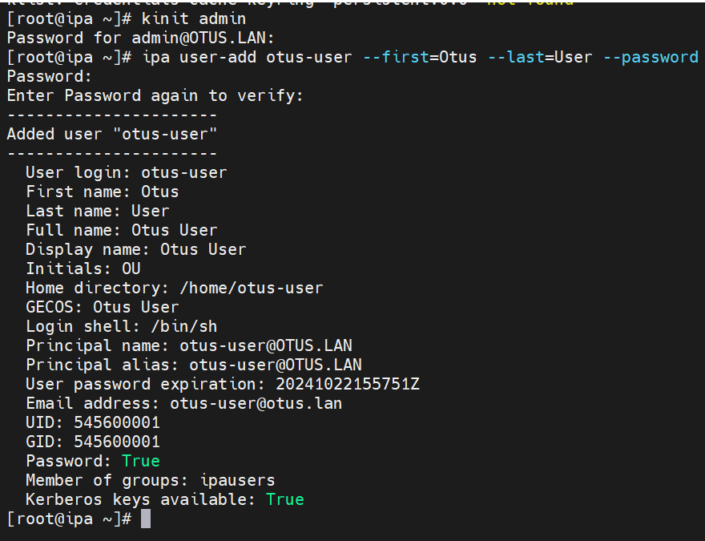

# homework-LDAP

Цель домашнего задания
---
- Научиться настраивать LDAP-сервер и подключать к нему LDAP-клиентов


---
ОС для настройки: 
- CentOS Linux release 7.9.2009 (Core) (особо сложностей из-за отличий с методичек не увидел, кроме того, что не увидел вывода данных сертификата после установки сервера)

Vagrant версии 2.4.1

VirtualBox версии 7.0.18

**Примечание** В Vagrantfile были внесены изменения в части урезания ресурсов, выделяемых для VM, но оставлено достаточно. 

---
- Этап 1: Создаем Vagrantfine, запускаем ВМ.

После того, как VM все таки развернулись, создадим\обновим файлы для приведения стенда к работе:

**На всех хостах с ОС Centos:**
1. Меняем репозиторий, потому что из коробки не работает
2. Менял на https://mirror.yandex.ru/centos/centos/7/os/x86_64/
3. Обновляем пакеты, устанавливаем ПО: yum install -y nano 


---
- Этап 2: Установка FreeIPA сервера

**Примечание**: В методичке предлагается сначала настроить FreeIPA-сервер. Однако анализируя команды, их понадобится выполнить скорее всего и на клиентах. Так что следующих список команд относится ко всем хостам. 


```bash
#Установим часовой пояс:
timedatectl set-timezone Europe/Moscow

#Установим утилиту chrony:
yum install -y chrony

#Добавим chrony в автозагрузку:
systemctl enable chronyd

#Выключим Firewall:
systemctl stop firewalld

#Отключаем автозапуск Firewalld:
systemctl disable firewalld

#Остановим Selinux:
setenforce 0
```


Далле нужно внести изменения в /etc/selinux/config. Меняем Selinux на disabled


**Вносим изменения в файл /etc/hosts, так как настройка DNS сервера не предполагается**


```bash
nano /etc/hosts

#добавляем в конец
192.168.57.10 ipa.otus.lan ipa
```


---
**Далее показана настройка именно Сервера. Клиенты тут не участвуют**

**Установим FreeIPA-сервер**


```bash
yum install -y ipa-server
```

Хм, а он много чего себе качает, однако 


**Запустим скрипт установки**


```bash
ipa-server-install


```
```bash
Далее, нам потребуется указать параметры нашего LDAP-сервера, после ввода каждого параметра нажимаем Enter,
если нас устраивает параметр, указанный в квадратных скобках, то можно сразу нажимать Enter:

Do you want to configure integrated DNS (BIND)? [no]: no
Server host name [ipa.otus.lan]: <Нажимаем Enter>
Please confirm the domain name [otus.lan]: <Нажимем Enter>
Please provide a realm name [OTUS.LAN]: <Нажимаем Enter>
Directory Manager password: <Указываем пароль минимум 8 символов>
Password (confirm): <Дублируем указанный пароль>
IPA admin password: <Указываем пароль минимум 8 символов>
Password (confirm): <Дублируем указанный пароль>
NetBIOS domain name [OTUS]: <Нажимаем Enter>
Do you want to configure chrony with NTP server or pool address? [no]: no
```


---

Как и говорилось в методичке, установка не быстрая. Я предполагаю, что долго генерируется сертификат, если вспоминать предыдущие ДЗ, где тоже этот процесс был не быстрым 


**Признаться**, меня удивила ошибка, которая вылезла после установки. 


Почему сервер не смог разрезолвить сам себя?).... И это при том, что в hosts внесено изменение. DNS не установлен.. Странно, в общем. 


---
**Надо проверить, что сервер Kerberos может выдать нам билет**


```bash
kinit admin                   #Формируем билет
Password for admin@OTUS.LAN:  #Указываем Directory Manager password
klist                         #Запросим список билетов Kerberos
```


**!!** Для удаление полученного билета воспользуемся командой: 


```bash
kdestroy
```

---
Чтобы попасть в Web-интерфейс сервера со своей, основной хостовой машины, надо внести изменения в файл hosts, дописав в конец строку 
192.168.57.10 ipa.otus.lan

*В Unix-based системах файл хост находится по адресу /etc/hosts, в Windows — c:\Windows\System32\Drivers\etc\hosts. Для добавления строки потребуются права администратора.*


---
Вносим изменения и стучимся в web через браузер. 


**Но он не пускает** и накатывает настольгия :) PS. Столько уже прошло лет с моей первой работы, а я как-то умудрился вспомнить, что уже сталкивался с таким, надо потыкать "отмена" несколько раз и…. Вуа-ля) Попадаем на истинную страницу авторизации


---
**Пришло время настроить клиентов**


Устанавливаем клиента freeipa


```bash
yum -y install freeipa-client
```


---
**Далее, нужно добавить хост клиента к домену. Для этого можно пройти такого же мастера (почти такого же), как при установке сервера, где поэтапно вводится всё. Но, функционал команды позволяет сделать это в одну строку.** (один минус, пароль светить приходится)


```bash
echo -e "yes\nyes" | ipa-client-install --mkhomedir --domain=OTUS.LAN --server=ipa.otus.lan --no-ntp -p admin -w some_pass
```

**Параметры команды**

```bash
--domain — имя домена
--server — имя FreeIPA-сервера
--no-ntp — не настраивать дополнительно ntp (мы уже настроили chrony)
-p — имя админа домена
-w — пароль администратора домена (IPA password)
--mkhomedir — создать директории пользователей при их первом логине
```


---
После подключения хостов к FreeIPA-сервер нужно проверить, что мы можем получить билет от Kerberos сервера


```bash
kinit admin
```

Если подключение выполнено правильно, то мы сможем получить билет, после ввода пароля. 


**Проверим работу LDAP** для этого на сервере FreeIPA создадим пользователя и попробуем залогиниться к клиенту

```bash
#Авторизируемся на сервере:
kinit admin
#Создадим пользователя
otus-user
```




---
**Идем на клиента**, например, client2


**выполним команду**


```bash
kinit otus-user
```


На этом процесс добавления хостов к FreeIPA-серверу завершен.
**Однако странно**, что после смены пароля, мы ничего не увидели, хотя бы слова "OK"

---
Для наглядности хочется прогуляться в UI сервера через браузер, обновляем вкладку, и видим пользователя. По крайней мере, он добавился. 


---
А вот если попробовать подключиться с клиента, но ошибиться в пароле, то получаем отбивку. Ну и + проверили, что Client1 тоже цепляется, хотя на запросе билета была тоже проверка доступности сервера


